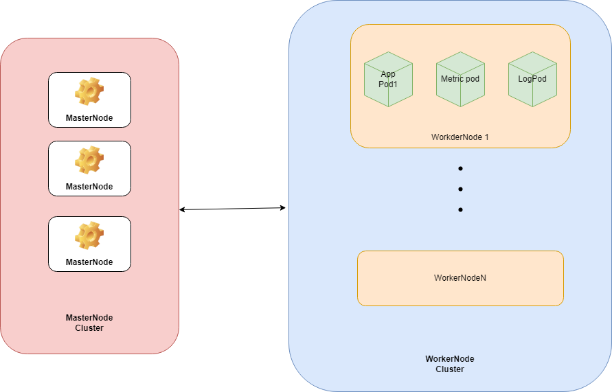

# 学习笔记

## K8s
https://kubernetes.io/zh/docs/concepts/architecture/nodes/
## aws
https://www.eksworkshop.com/beginner/180_fargate/

## auth
-session
-JWT

## POSTGRESQL
- aws aurora serverless db
- indexes

## EMAIL(MAILU)
- mailu
-stmp pop3

## markdown
[doc](https://spec.commonmark.org/0.30/)

## test lab
- Latex

## workflow

|                 |        **Period 1**       |             **Period 2**             |
|:---------------:|:-------------------------:|:------------------------------------:|
| **backend dev** |     backend local dev     | ACK deployment/ K8s test,prod/ CI/CD |
|  **mobile dev** |       IOS/MacOS dev       |               IOS CI/CD              |
|   **content**   | algebra/calculus learning |        statistic / ML learning       |
|   **schedule**  |      6,7,8,9,10           |            11,12,1,2                 |

## k8s structure

高可用集群要有至少3个masternode。

- 使用阿里云ACK PRO， 起始过程创建3个节点，一个master，2个worker。
- 集群不需要自己创建，可以使用ACK的集群管理。
- 自己通过HELM搭建监控和日志搜集 DEAMONSET
- 自己创建私有仓库
- 容器运行时使用containerd
- 通过HPA 自动扩容部署，让K8S根据POD的资源利用情况自动扩容收缩
- 利用label 分离test和prod

对于应用架构
- 可以不使用RDS，只使用REDIS的JSON存储即可。将文件资源存储到REDIS，图像模型等资源存储到对象存储
- 微服务架构 鉴权 和 应用服务
